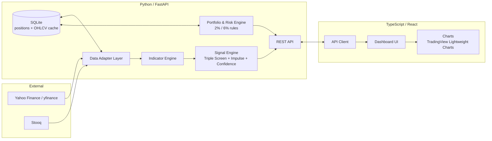

# Architecture Overview

This is the index document for fintrade's architecture. Detailed per-area docs live in `docs/architecture/`:

- [Backend](architecture/Backend.md) — Python/FastAPI service: data ingestion, indicators, signal engine, portfolio/risk, persistence.
- [Frontend](architecture/Frontend.md) — TypeScript/React dashboard: charts, portfolio views, signal display.
- [API Contract](architecture/API.md) — REST endpoints shared between backend and frontend.
- [Testing](architecture/Testing.md) — 90% coverage requirement, tooling, and CI enforcement for both sides.

See [Analyse.md](Analyse.md) for the analytical methodology (Elder's Triple Screen System) these components implement.

---

## 1. System Shape

Two deployable units: a Python backend and a TypeScript frontend, talking over a REST/JSON API. No separate microservices for MVP — the indicator engine, signal engine, and portfolio/risk engine are modules within one backend service, not separate deployments. Split them out later only if a concrete scaling reason appears.

## 2. Tech Stack Summary

| Layer | Choice | Why |
|---|---|---|
| Backend language/framework | Python 3.12+, FastAPI | pandas makes Elder's indicators tractable to hand-write against Analyse.md's exact definitions; yfinance is Python-native |
| Backend persistence | SQLite via SQLAlchemy | Single-user MVP, zero ops overhead, trivially swappable for Postgres later |
| Market data | yfinance (primary), Stooq (fallback) | Both free, no API key; see [Analyse.md §9](Analyse.md#9-data-sources-free) |
| Frontend language | TypeScript (required) | Type safety across API boundary, catches indicator/shape mismatches at compile time |
| Frontend framework | React + Vite | Dashboard is stateful/interactive, not content-driven — Astro's static-first model doesn't fit |
| Frontend components | Material UI (MUI) | Material Design baseline for forms/tables/dialogs/nav; no second component library or hand-rolled CSS framework alongside it |
| Frontend server state | TanStack Query only — no Redux/MobX | See [Frontend.md §2](architecture/Frontend.md#2-state-management-server-state-only-no-client-state-library) |
| Charting | TradingView Lightweight Charts | Candlestick chart over raw OHLCV; no indicator overlay — see [Frontend.md §5](architecture/Frontend.md#5-chart--indicator-display-what-the-backend-actually-supports) for why |
| API style | REST/JSON | Simple contract, easy to test and mock on both sides |
| Test coverage gate | 90% lines, both frontend and backend | See [Testing.md](architecture/Testing.md) |

## 3. Cross-Cutting Decisions

- **No live network calls in tests.** Every test (backend and frontend) mocks the external data provider / API boundary. This keeps the 90% coverage suite fast and deterministic, and avoids tests failing because Yahoo rate-limited us.
- **Indicator math is unit-tested against hand-computed reference values**, not just "does it run" — see [Backend.md](architecture/Backend.md#testing-notes).
- **Confidence scores and signals are computed entirely in the backend.** The frontend renders what the API returns; it does not re-implement or adjust scoring logic. Keeps the Elder methodology in one place, testable once.
- **OHLCV is cached in SQLite**, keyed by ticker + date, to avoid re-fetching unchanged history on every request and to stay within free-tier rate limits.

## 4. Deployment (MVP scope)

Single host: FastAPI served behind Uvicorn, static React build served separately (or via the same host through a reverse proxy). No auth/multi-tenancy in MVP scope — this is a personal-portfolio tool. Revisit if/when multi-user support is needed.
